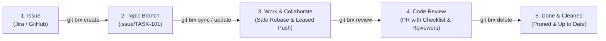

<div align="center">


# git-brx

**Opinionated, simple Git workflow with user-friendly automation.**

[](https://github.com/bvarnai/git-brx/actions/workflows/ci.yml)
[](go.mod)
[](LICENSE)
[]()
[]()

<p align="center">
  <a href="#why-git-brx">Why git-brx?</a> •
  <a href="#the-git-brx-philosophy">Core Philosophy</a> •
  <a href="#quick-start">Quick Start</a> •
  <a href="#installation">Installation</a> •
  <a href="#configuration">Configuration</a> •
  <a href="#documentation-wiki">User Guide Wiki</a>
</p>

</div>

---

## Why git-brx?

Git is undeniably the industry standard for source control, but its command-line interface was designed as a low-level plumbing toolkit rather than an ergonomic user interface. As teams grow, several systemic problems reliably emerge:

- **Tooling Intimidation & Onboarding Friction:** New hires, junior engineers, and specialists from non-software backgrounds (data scientists, hardware designers, technical writers) are often intimidated by Git's cryptic error messages, endless plumbing flags, and steep learning curve.
- **Fear of Breaking Things:** Developers hesitate to rebase, synchronize, or clean up branches because one wrong command (`git push --force`, `git reset --hard`, `git checkout .`) can silently discard hours of work or overwrite a teammate's commits.
- **Inconsistent Team Habits:** Without standard tooling, every developer invents their own ad-hoc aliases, naming conventions, and merge practices. Some squash locally, some create tangled merge webs, and some leave dozens of abandoned branches lingering on the remote.
- **Overengineered Workflows:** Many teams suffer under heavy, bureaucratic branching models designed for massive enterprises with dedicated DevOps support. Smaller or fast-moving teams need a clean, lightweight flow that just works without overhead.

**`git-brx` eliminates this friction.** It acts as an intelligent, guardrailed layer over Git that hides low-level complexity, prevents disastrous mistakes, and gives teams a simple, intuitive workflow from task creation to merged code.

### Why the name "brx"?
Originally short for **branch**, `brx` also sounds like **brakes**—and that analogy perfectly captures the tool's core philosophy:

> *"The purpose of brakes on a car isn't just to make you stop; it's to give you the confidence and control to drive fast."*

Without reliable brakes, engineers crawl through Git walking on eggshells—afraid of messy rebases, destructive force pushes, or losing uncommitted work. `git-brx` equips your development workflow with high-performance brakes and guardrails. You stay in complete control, stop safely whenever needed, and enjoy a smooth, confident ride from branch creation to merged code.

---

## The git-brx Philosophy

### 1. Issue-First Development: The Contract of Record
In `git-brx`, **every code change begins with an Issue** (Jira, GitHub Issues, etc.):
- **The Issue defines "What" and "Why":** Business context, specifications, edge cases, and acceptance criteria live exclusively in the issue tracker.
- **The Pull Request inspects "How":** Code review discussions are strictly technical—evaluating architecture, code quality, test coverage, and security. Reviewers don't have to rediscover missing requirements during code review because the issue is already the single source of truth.

### 2. Guardrailed, Fearless Collaboration
You don't need to be a Git wizard to work safely:
- All remote pushes use **leased safety** (`--force-with-lease`) to prevent stale branch overwrites.
- Branch synchronization defaults to **clean linear rebasing** for issue tasks, keeping `master`/`main` bisectable.
- Conflict resolution (`git brx resolve`) interactively launches your GUI merge tool and stages **only** the conflicting files—never indiscriminate directory staging.
- Deleting a branch (`git brx delete`) verifies that your PR has been merged on the remote platform first.

### 3. The 4-Step Branch Lifecycle



---

## Quick Start

Experience the full branch workflow with just 5 commands:

```bash
# 1. Create and checkout a validated branch linked to your tracker
git brx create issue/TASK-101

# ... write code, make regular git commits ...

# 2. Keep up-to-date with master/main cleanly via rebase
git brx sync

# 3. Publish to remote with safe lease and upstream tracking
git brx publish

# 4. Open a pull request with automated reviewer assignment and merge instructions
git brx review

# ... PR is approved and merged on GitHub / Bitbucket ...

# 5. Verify remote deletion, switch to master, and prune local branch
git brx delete
```

---

## Available Commands

When installed in your `PATH`, `git-brx` is automatically available as a native Git plugin via `git brx <command>`:

| Command | Purpose |
| :--- | :--- |
| [`git brx create`](docs/user-guide/branch-lifecycle.md#1-branch-creation) | Validates against issue tracker and provisions topic branch. |
| [`git brx select`](docs/user-guide/branch-lifecycle.md#2-branch-switching) | Safely switches branches with typo suggestions and uncommitted change warnings. |
| [`git brx sync`](docs/user-guide/synchronization-and-rebasing.md#1-synchronizing-with-base-git-brx-sync) | Synchronizes active branch with base (rebase for issues, merge for features). |
| [`git brx update`](docs/user-guide/synchronization-and-rebasing.md#2-updating-from-remote-git-brx-update) | Rebase-pulls remote upstream commits into local branch. |
| [`git brx resolve`](docs/user-guide/synchronization-and-rebasing.md#3-resolving-conflicts-git-brx-resolve) | Launches your GUI merge tool and continues in-flight rebase or merge. |
| [`git brx reset`](docs/user-guide/synchronization-and-rebasing.md#4-safe-recovery-git-brx-reset) | Aborts in-flight rebases/merges and restores clean state from remote tracking ref. |
| [`git brx publish`](docs/user-guide/branch-lifecycle.md#3-leased-publishing) | Pushes branch to remote with `--force-with-lease` and configures upstream tracking. |
| [`git brx review`](docs/user-guide/branch-lifecycle.md#4-code-review-submission) | Creates a pull request with reviewer routing and timeless merge instructions. |
| [`git brx delete`](docs/user-guide/branch-lifecycle.md#5-safe-post-merge-deletion) | Verifies remote PR merge, switches to `master`, and safely deletes local branch. |
| [`git brx history`](docs/user-guide/command-reference.md#git-brx-history) | Renders a formatted commit graph (with `--topic` delta filtering). |
| [`git brx name`](docs/user-guide/command-reference.md#git-brx-name) | Prints the active branch name (plumbing-safe for scripts). |

All commands support `--help`, `-h`, and `--dry-run` (`-n`) for safe previewing.

---

## Installation

### Pre-Built Binaries
Download the latest release for Linux, macOS, or Windows from the [Releases](https://github.com/bvarnai/git-brx/releases) page. Extract and place `git-brx` in your `PATH` (e.g. `/usr/local/bin` or `~/bin`).

### From Source (Go >= 1.22)
```bash
git clone https://github.com/bvarnai/git-brx.git
cd git-brx
go build -o /usr/local/bin/git-brx ./cmd/git-brx
```

Verify your installation:
```bash
git brx --version
# git-brx version v1.0.0 (commit: abc1234, built at: 2026-10-09, linux/amd64)
```

---

## Configuration

`git-brx` works out-of-the-box with **zero configuration** by auto-detecting your remote origin URL (`github.com`, Bitbucket Server, etc.).

For team-wide customizations, add `.git-brx.yaml` to the root of your repository:

```yaml
# Preset platform ('github' or 'bitbucket')
platform: github

# Reviewer routing based on affected components/labels
review:
  instructions: true
  template: .github/pull_request_template.md
  mapping:
    backend: [alice, bob]
    frontend: [carol, dave]
    default: [charlie]
```

See [Configuration Guide](docs/user-guide/getting-started.md#configuration-cascade) for detailed options.

---

## Documentation Wiki

Explore the complete user guide and technical manuals:

- 📖 **[User Guide Index](docs/user-guide/README.md)**: Full table of contents.
- 🎯 **[Philosophy & Principles](docs/user-guide/philosophy.md)**: Deep dive on the mental model, psychological safety, and issue-driven development.
- 🚀 **[Getting Started](docs/user-guide/getting-started.md)**: Setup, credentials, and configuration cascade.
- 🔄 **[Branch Lifecycle Guide](docs/user-guide/branch-lifecycle.md)**: Step-by-step from branch creation to post-merge deletion.
- ⚡ **[Synchronization & Rebasing](docs/user-guide/synchronization-and-rebasing.md)**: Rebase workflows, resolving conflicts, and resetting.
- 🌐 **[Multi-Platform Integration](docs/user-guide/multi-platform.md)**: Setting up GitHub, Bitbucket Server, and Jira.
- 📚 **[Command Reference](docs/user-guide/command-reference.md)**: Comprehensive reference for all commands and flags.
- 💡 **[Troubleshooting & FAQ](docs/user-guide/troubleshooting-faq.md)**: Common questions and diagnostic solutions.

---

## License

This project is licensed under the [MIT License](LICENSE).
