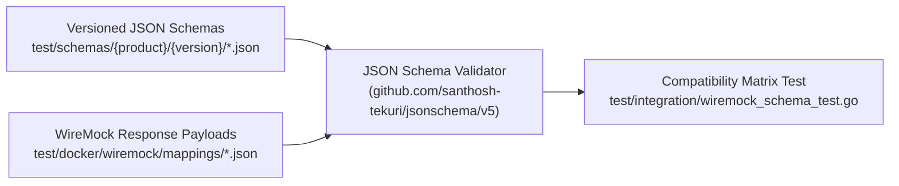

# Atlassian REST Schema Validation & Compatibility Matrix Guide

This document explains how `git-brx` validates API payloads against official Atlassian REST schemas, how the automated compatibility matrix works, and how to add new server release versions.

---

## 1. Architecture & Design

Rather than maintaining brittle, manual Go assertion structs that can drift from official specifications, `git-brx` uses a **schema-first validation engine**:



### Core Principles
1. **Official Provenance:** Every schema file contains an audit `source` block documenting the exact URL, HTTP method, status code, and extraction origin.
2. **Standard Validation Engine:** Schemas are compiled and evaluated using standard JSON Schema Draft-7 (`github.com/santhosh-tekuri/jsonschema/v5`).
3. **Multi-Version Testing:** Stubs are tested against a matrix of supported server versions to ensure forward and backward compatibility.

---

## 2. Directory Structure

```text
test/
├── schemas/
│   ├── jira/
│   │   ├── v2-server-7.6/
│   │   │   ├── issue.json              # Official IssueBean schema
│   │   │   └── error_collection.json   # Official ErrorCollection schema
│   │   └── v2-server-8.x/
│   │       ├── issue.json
│   │       └── error_collection.json
│   └── bitbucket/
│       ├── v1-server-6.1/
│       │   ├── pull_request.json       # Official RestPullRequest schema
│       │   └── errors.json             # Official RestErrors schema
│       └── v1-server-8.19/
│           ├── pull_request.json
│           └── errors.json
├── docker/
│   └── wiremock/
│       └── mappings/                   # Canonical mock responses
└── integration/
    └── wiremock_schema_test.go         # Automated matrix test suite
```

---

## 3. Schema Provenance Sources

- **Jira Server:** Extracted directly from Atlassian's machine-readable WADL descriptor (`https://docs.atlassian.com/software/jira/docs/api/REST/7.6.1/jira-rest-plugin.wadl`). The XML embeds raw JSON Schema Draft-7 strings within `response/representation/doc/pre/code` CDATA tags.
- **Bitbucket Server:** Formulated from Atlassian's official HTML REST API reference (`https://docs.atlassian.com/bitbucket-server/rest/6.1.3/bitbucket-rest.html#idp252`).

Each schema file embeds an immutable metadata block:
```json
"source": {
  "product": "Bitbucket Server",
  "version": "6.1.3",
  "extractedFrom": "official_html_reference_contract",
  "docUrl": "https://docs.atlassian.com/bitbucket-server/rest/6.1.3/bitbucket-rest.html#idp252",
  "resourcePath": "/rest/api/1.0/projects/{projectKey}/repos/{repositorySlug}/pull-requests",
  "method": "POST",
  "responseStatus": 201,
  "modelName": "RestPullRequest",
  "extractionNotes": "Extracted from official Atlassian HTML reference at anchor #idp252"
}
```

---

## 4. Running the Compatibility Matrix

Run the automated matrix test suite:
```bash
go test -v ./test/integration/... -run "CompatibilityMatrix|Rejection"
```

To run all tests including race detection:
```bash
go test -v -race ./...
```

---

## 5. How to Add a New Server Version

When onboarding support for a new server release (e.g., Jira `v2-server-9.x` or Bitbucket `v1-server-9.x`):

### Step 1: Create the Version Directory
```bash
mkdir -p test/schemas/jira/v2-server-9.x
mkdir -p test/schemas/bitbucket/v1-server-9.x
```

### Step 2: Add or Copy the Schema Files
Extract or copy the schema files into the new directory:
- For Jira: `issue.json` and `error_collection.json`.
- For Bitbucket: `pull_request.json` and `errors.json`.

Update the version number and reference URLs inside the `"source"` metadata block:
```json
"source": {
  "product": "Jira Server",
  "version": "9.4.0",
  "extractedFrom": "official_wadl_xml_cdata",
  "wadlUrl": "https://docs.atlassian.com/software/jira/docs/api/REST/9.4.0/jira-rest-plugin.wadl",
  ...
}
```

### Step 3: Register the Version in the Test Matrix
Open [`test/integration/wiremock_schema_test.go`](test/integration/wiremock_schema_test.go) and append the new version string to the target slice:

For Jira:
```go
jiraVersions := []string{
    "v2-server-7.6",
    "v2-server-8.x",
    "v2-server-9.x", // Added version
}
```

For Bitbucket:
```go
bbVersions := []string{
    "v1-server-6.1",
    "v1-server-8.19",
    "v1-server-9.x", // Added version
}
```

### Step 4: Run the Test
```bash
go test -v ./test/integration/... -run "CompatibilityMatrix"
```
If the new server release introduced breaking changes or modified field constraints, the test will fail immediately and print the exact JSONPath discrepancy.
