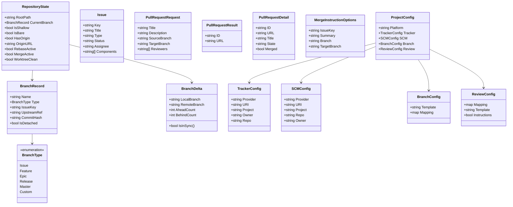

# Global Technical Specification: git-brx

## 1. Binary & CLI Conventions

- **Binary Name:** `git-brx`
  - **Direct Invocation:** Executed directly from terminal or automation scripts as `git-brx <subcommand> [flags] [arguments]`.
  - **Git Plugin Dispatch:** Automatically available as a native Git subcommand `git brx <subcommand> [flags] [arguments]` whenever `git-brx` resides in the host `PATH` (utilizing Git's standard `git-<name>` binary execution resolution).
  - **Legacy Alias Deprecation:** Replaces legacy standalone Git aliases (`branch-create`, `branch-publish`, `branch-sync`, etc.) with unified subcommand routing under `git-brx`.

### Available Subcommands

| Subcommand | Legacy Equivalent | Primary Purpose |
| :--- | :--- | :--- |
| `name` | `name.sh` | Prints the current active branch name. |
| `history` | `history.sh` | Renders a formatted commit graph / DAG. |
| `update` | `update.sh` | Pulls remote changes using rebase onto the local branch. |
| `select` | `select.sh` | Fetches remotes and switches working tree to target branch (default: `master`). |
| `sync` | `sync.sh` | Synchronizes branch with target base (rebase for issues, merge for features). |
| `reset` | `reset.sh` | Aborts active merges/rebases and hard-resets working copy to remote tracking ref. |
| `resolve` | `resolve.sh` | Launches interactive merge tool and continues in-flight rebase or merge. |
| `create` | `create.sh` / `create.groovy` | Validates against issue tracker (JIRA) and provisions local topic branch. |
| `publish` | `publish.sh` | Pushes branch to remote with lease and configures upstream tracking. |
| `delete` | `delete.sh` | Validates remote branch deletion, switches to `master`, and deletes local branch. |
| `review` | `review.sh` | Creates a pull request on configured SCM platform (Bitbucket, GitHub) via REST API with reviewer mapping. |

### Global Flags

The following flags must be accepted across the root binary and all subcommands:

- `--verbose`, `-v`: Enables debug and diagnostic output on standard error. Logs all raw Git commands executed, HTTP request/response metadata, and path resolution calculations.
- `--quiet`, `-q`: Suppresses all informational notices, hints, and progress indicators. Only functional stdout data and fatal errors are emitted.
- `--dry-run`, `-n`: Runs mutating subcommands in simulation mode. Validates preconditions, computes changes, and prints planned mutations without modifying Git references, working tree files, or external services.
- `--no-color`: Explicitly disables ANSI color escapes across all output streams.
- `--help`, `-h`: Prints concise help, usage syntax, and available options for the command.
- `--version`: Prints semantic version, build commit, build date, and compiler runtime information.

### Output Protocols

- **Standard Output (`stdout`):**
  - Reserved strictly for machine-readable output and primary functional data payloads.
  - Subcommands whose primary purpose is to emit a value (e.g., `git-brx name`) must write only the target string followed by a newline (`\n`), with zero log prefixes or decoration, ensuring safe pipe chaining (`BRANCH=$(git-brx name)`).
  - Terminal-oriented commands (such as `history`) stream formatted text directly to stdout. If piped to a non-TTY, styling and pager escapes must be stripped or disabled.
- **Standard Error (`stderr`):**
  - Dedicated exclusively to diagnostic streams, informational feedback, warnings, and error messages.
  - **Structured Logging Prefixes:**
    - Informational / progress: `[git-brx] <message>`
    - Warnings: `[git-brx] Warning: <message>`
    - Errors: `[git-brx] ! <message>`
    - Actionable hints: `[git-brx] Hint: <message>`
- **Terminal Color Handling:**
  - **TTY Auto-Detection:** ANSI color sequences are enabled by default if and only if standard error is connected to an interactive terminal (`isatty`).
  - **`NO_COLOR` Standard:** If the environment variable `NO_COLOR` is defined (regardless of value, per `no-color.org`), colorization is disabled.
  - **CLI Override:** Passing `--no-color` unconditionally forces monochromatic plain text output.
  - **Color Palette:**
    - Errors (`!`): Bright Red (`\033[31;1m`).
    - Warnings: Yellow (`\033[33m`).
    - Hints: Cyan (`\033[36m`).
    - Reset: Plain text reset (`\033[0m`).

---

## 2. Environment & Runtime Context

### Required Host Binaries

- **Minimum Git Version:** `git` >= 2.20.0
  - Rationale: Mandatory for stable `--force-with-lease` safety semantics, `git rev-parse --is-shallow-repository`, machine-readable `git status --porcelain=v2`, and reliable `git merge-base` operations.
- **Optional External Utilities:**
  - `git-mergetool`: Relies on whatever diff/merge GUI tool is configured in the user's `git config merge.tool` (e.g., Beyond Compare, Meld, VSCode).
- **Eliminated Dependencies (Zero Runtime Footprint):**
  - No dependency on Java Runtime Environment (JRE), Groovy, Jansi, Bash, Cygwin (`cygpath`), or external Windows executable wrappers (`WinCreds.exe`).

### Environment Variables Read

| Variable | Purpose | Default / Fallback | Validation Rules |
| :--- | :--- | :--- | :--- |
| `NO_COLOR` | Disables ANSI escape coloring. | Unset (color auto-detection enabled). | Any non-empty value disables colors. |
| `CI` / `VSB_CI` | Identifies execution within a CI environment. | Unset. | Disables interactive prompts; fails if confirmation required. |
| `GIT_PREFIX` | Relative offset when invoked from repository subdirectories. | Empty string (root). | Set automatically by Git during plugin/alias dispatch. |
| `GIT_DIR` | Override path to `.git` repository metadata. | Auto-detected via Git plumbing. | Must point to a valid Git directory structure. |
| `GIT_WORK_TREE` | Override path to top-level working directory. | Auto-detected via Git plumbing. | Must point to a valid directory. |
| `GIT_BRX_CONFIG_PATH` | Explicit file or directory path for project configuration. | Search standard configuration cascade. | Must be readable file or directory if provided. |
| `GIT_BRX_TOKEN` | Authentication token for JIRA and Bitbucket REST APIs. | Consult Git credential helper or OS keychain. | Non-empty string. |
| `HTTP_PROXY` / `HTTPS_PROXY` | Proxy endpoint for outgoing HTTP REST API requests. | System default / direct connection. | Valid URI syntax (`http://host:port`). |
| `NO_PROXY` | Comma-separated list of host globs to bypass proxy. | Empty string. | Standard proxy exclusion format. |

### Environment Variables Injected / Propagated

When spawning child Git processes, `git-brx` injects:

- `LC_ALL=C`: Injected across all child Git plumbing executions to prevent locale-dependent output parsing failures and guarantee invariant English formatting.
- `GIT_TERMINAL_PROMPT=0`: Injected during automated non-interactive checks (e.g., `git ls-remote`) to prevent background worker hangs on missing credentials.

### Git Context & Path Resolution

- **Repository Validation Assertions:**
  - Execute `git rev-parse --is-inside-work-tree`. If output is not `true` (exit code != 0), terminate immediately with Exit Code `3`.
  - Disallow execution directly within `.git` administrative internals (`git rev-parse --is-inside-git-dir` must be `false`).
  - Disallow mutating operations on bare repositories (`git rev-parse --is-bare-repository` must be `false`).
- **Handling of `GIT_PREFIX` and Working Directory:**
  - When invoked from a sub-folder within a repository, Git sets `GIT_PREFIX` (e.g., `src/pkg/`).
  - The binary must resolve the repository root via `git rev-parse --show-toplevel`.
  - All repository-wide Git commands (`git fetch`, `git pull`, `git rebase`, `git merge`, `git checkout`) must run anchored to the top-level repository root to prevent path-relative side effects.
  - The working directory of the process is normalized to the repo root internally, while preserving the user's caller context for diagnostic messages.

---

## 3. Standard Exit Code Matrix

The Go implementation must adhere to a strict, application-wide exit code contract:

| Exit Code | Semantic Meaning | Common Triggers |
| :--- | :--- | :--- |
| `0` | Success | Command completed cleanly with zero errors. |
| `1` | General Runtime Error | Unhandled execution exception, panic recovery, or unexpected I/O error. |
| `2` | Command-Line Usage / Syntax Error | Unknown flag, invalid flag value, wrong number of positional arguments. |
| `3` | Git Repository Precondition Failure | Not inside a Git worktree, bare repository, prohibited shallow repository, or detached HEAD. |
| `4` | Remote / Network Precondition Failure | Remote `origin` not configured, remote unreachable (DNS/timeout), network down without `--offline`. |
| `5` | Git State / Merge Conflict Encountered | In-flight rebase or merge already detected, or merge conflicts triggered during `sync` or `update`. |
| `6` | External Service / API Failure | JIRA or Bitbucket API returned HTTP 401, 403, 404, or 409, or schema validation failed. |
| `7` | User Aborted / Canceled | User declined interactive confirmation (`[y/N]`), aborted credential entry, or sent `SIGINT`. |
| `8` | Configuration / Validation Error | Missing `branch.json` / `manifest.json`, malformed JSON, or branch name fails regex naming contract. |

---

## 4. External Git Execution Boundary & Safety

### Git Invocation Standards

1. **Plumbing Over Porcelain:**
   - The Go binary must never parse human-readable porcelain commands (`git status`, `git branch`, `git log`) where machine-readable plumbing alternatives exist.
   - **Branch Inspection:** Use `git symbolic-ref --short -q HEAD` to retrieve the current branch name. A non-zero exit code indicates detached HEAD.
   - **Local Branch Existence:** Use `git show-ref --verify --quiet refs/heads/<branch>`.
   - **Remote Branch Existence:** Use `git ls-remote --heads origin <branch>`.
   - **Upstream Tracking Association:** Use `git rev-parse --abbrev-ref --symbolic-full-name @{upstream}` or `git for-each-ref --format='%(upstream:short)' refs/heads/<branch>`.
   - **Ahead/Behind Commit Deltas:** Compute directly via `git rev-list --left-right --count <local>...<remote>`. Parses two integer tokens (`<ahead>\t<behind>`) in-memory with zero file system touches.
   - **Merge Base Resolution:** Use `git merge-base <branchA> <branchB>`.
   - **Dirty Worktree Check:** Use `git diff-index --quiet HEAD --` (exit code `1` means uncommitted modifications).
   - **Shallow Repository Check:** Use `git rev-parse --is-shallow-repository`.
2. **Execution Boundary & Isolation:**
   - Execute Git binaries directly via Go `os/exec.CommandContext` without invoking an intermediate shell (`/bin/sh` or `cmd.exe`). This eliminates command injection risks and argument quote parsing discrepancies across Linux and Windows.
   - Set child process environment with `LC_ALL=C`.

### Interruption & Signal Handling

- **Signal Interception:** The binary traps `SIGINT` (Ctrl+C) and `SIGTERM`.
- **Context Cancellation:** All child processes and HTTP operations run with a `context.Context` derived from `signal.NotifyContext`.
- **Lockfile & Clean State Preservation:**
  - Upon receiving an interruption signal, the parent process waits up to 2 seconds for child Git operations to gracefully close open file handles and release `.git/index.lock`.
  - If a mutating operation (e.g., `git checkout -b` or branch rename) was interrupted mid-flight, diagnostic cleanup instructions are logged to `stderr`.
- **No Orphan Temporary Artifacts:** All IPC and delta computations occur in memory; no residual temp files remain on disk.

### Dry-Run Guarantees

When `--dry-run` (`-n`) is specified:

- **No Local Ref Mutations:** Zero invocations of `git checkout -b`, `git branch -D`, `git reset --hard`, `git merge`, or `git rebase`.
- **No Working Tree Touches:** Zero staging (`git add`), unstaging, or checkout overwrites.
- **No Remote Network Mutations:** Zero executions of `git push`, and zero mutating HTTP requests (POST, PUT, DELETE) against Bitbucket Server or JIRA.
- **Predictive Output:** Logs the exact sequence of Git plumbing commands and external API requests that would be executed in live mode.

### Repository Inspection vs. Preflight Checks Strategy

To maintain strict boundary separation, testability, and clean diagnostics across all subcommands, repository interrogation and domain rule enforcement are decoupled into two distinct packages:

1. **Inspection Engine (`internal/git.Inspector`): Pure Telemetry**
   - **Role:** Queries raw repository state via Git plumbing and filesystem indicators.
   - **Responsibility:** Returns pure telemetry data (raw strings, booleans, structs).
   - **Boundary Constraint:** Has zero knowledge of UI formatting, terminal styles, exit codes, or domain `AppError`. It never logs to stderr or stdout. Errors returned are standard Go errors indicating Git subprocess execution failures.
   - **Naming Convention:** Direct attribute/query signatures (e.g., `IsWorkTree`, `RepoRoot`, `ActiveOperation`, `DefaultBranch`, `BranchDelta`).

2. **Preflight Checks Engine (`internal/checks`): Invariant Enforcement**
   - **Role:** Evaluates repository state returned by `Inspector` against command preconditions and domain invariants.
   - **Responsibility:** Fatal preflight checks that assert conditions that must hold true before a command proceeds.
   - **Boundary Constraint:** Pure rule validation; has no UI dependencies. On violation, returns structured `domain.AppError` mapped to specific application exit codes:
     - `InsideWorkTree(ctx, inspector, dir) (string, error)` (Exit Code 3)
     - `NoActiveOperation(ctx, inspector, rootDir) error` (Exit Code 5)
     - `NoOrphanedCommits(ctx, inspector, rootDir) error` (Exit Code 5)
   - **Command-Specific UX Notices:** Non-fatal UX guidance and warnings (e.g., behind upstream sync hints or dirty tree carryover warnings) are presented by CLI command handlers using `ui.UI`.

---

## 5. Shared Domain Models

The following domain entities define the core data models shared across all subcommands:



### 1. `BranchRecord`
Represents an inspected Git branch:
- `Name`: Full short ref name (e.g., `issue/VSB-1234`).
- `Type`: Classified branch category based on naming convention (`Issue`, `Feature`, `Epic`, `Release`, `Master`, `Custom`).
- `IssueKey`: Parsed issue identifier extracted via configured pattern (e.g., `VSB-1234`).
- `UpstreamRef`: Tracking remote ref name (e.g., `origin/issue/VSB-1234`).
- `CommitHash`: Current HEAD commit SHA of the branch.
- `IsDetached`: Boolean indicating if HEAD is decoupled from a symbolic ref.

### 2. `BranchDelta`
Captures divergence between a local branch and its remote upstream:
- `LocalBranch`: Name of the local branch ref.
- `RemoteBranch`: Name of the corresponding upstream tracking ref.
- `AheadCount`: Number of commits present locally but not on remote.
- `BehindCount`: Number of commits present on remote but not locally.
- `IsInSync()`: Returns true if both `AheadCount == 0` and `BehindCount == 0`.

### 3. `RepositoryState`
Encapsulates global repository topology and active transient operations:
- `RootPath`: Absolute filesystem path to the repository root directory.
- `CurrentBranch`: Pointer to the active `BranchRecord`.
- `IsShallow`: True if repository history is truncated.
- `IsBare`: True if working tree is absent.
- `HasOrigin`: True if remote `origin` is defined.
- `OriginURL`: Remote endpoint URI configured for `origin`.
- `RebaseActive`: True if `.git/rebase-merge` or `.git/rebase-apply` exists.
- `MergeActive`: True if `.git/MERGE_HEAD` exists.
- `WorktreeClean`: True if index and working tree contain no staged or unstaged diffs.

### 4. `Issue` & `IssueTracker`
Provider-agnostic issue representation and interface:
- `Key`: Unique issue identifier (e.g. `VSB-5294`, `#101`).
- `Title`: Summary or title of the issue.
- `Type`: Issue category (e.g. `Bug`, `Story`, `Task`, `feature`).
- `Status`: Current state (e.g. `Open`, `In Progress`, `Closed`).
- `Assignee`: Assigned username or handle.
- `Components`: Components or labels linked to the issue.

```go
type IssueTracker interface {
    Name() string
    GetIssue(ctx context.Context, key string) (*Issue, error)
}
```

### 5. `PullRequest` & `SCMProvider`
Provider-agnostic pull request models and interface:
- `PullRequestRequest`: Input payload specifying `Title`, `Description`, `SourceBranch`, `TargetBranch`, and `Reviewers`.
- `PullRequestResult`: Created PR identifiers (`ID` string, `URL` string).

```go
type SCMProvider interface {
    Name() string
    CreatePullRequest(ctx context.Context, req PullRequestRequest) (*PullRequestResult, error)
    GetPullRequestForBranch(ctx context.Context, branch string) (*PullRequestDetail, error)
    ResolveReviewers(components []string) []string
    FormatMergeInstructions(opts MergeInstructionOptions) string
}
```

### 6. `ProjectConfig`
Structured schema parsed from YAML (`.git-brx.yaml` / `.git-brx/config.yaml`):
- `Platform`: Preset identifier (`github`, `gitlab`, `bitbucket`) when one platform serves both tracking and SCM.
- `Tracker`: Issue tracker settings (`Provider`, `URI`, `Project`, `Owner`, `Repo`).
- `SCM`: SCM / code review settings (`Provider`, `URI`, `Project`, `Repo`, `Owner`).
- `Branch`: Topic branch naming rules (`Template` regex, `Mapping` between issue types and branch prefixes).
- `Review`: Code review settings (`Mapping` between components and reviewers, `Template` checklist markdown).

---

## 6. Discrepancies, Anti-Patterns & Modernization Notes

### Legacy Fragility & Anti-Patterns

1. **Shared `/tmp` Files & Concurrency Race Conditions:**
   - *Legacy Flaw:* `common.sh` wrote upstream status deltas to hardcoded temporary files:
     ```bash
     git rev-list --left-right "${local_branch}...${remote_branch}" -- 2>/dev/null >/tmp/git_upstream_status_delta
     echo "${local_branch}|${LEFT_AHEAD}|${remote_branch}|${RIGHT_AHEAD}" >/tmp/branch_delta
     ```
   - *Failure Mode:* Running multiple commands concurrently or having multi-user shared machines causes file collision, race conditions, permission denial, and data corruption.
   - *Go Modernization:* Execute `git rev-list --left-right --count <local>...<remote>` and parse the output directly from memory via standard io/buffer pipes. Zero filesystem writes.

2. **Fragile Working Directory & Project Detection:**
   - *Legacy Flaw:* Project identity was computed by splitting the current working directory name:
     ```bash
     PROJECT=$(basename "$(pwd)" | cut -d _ -f 1)
     BRANCH_CONFIGURATION_PATH="${ENV_ROOT}/../conf/${PROJECT}"
     ```
   - *Failure Mode:* If a developer invoked the tool from a subdirectory, or if their repository clone folder did not contain an underscore (`_`), project detection completely failed.
   - *Go Modernization:* Always resolve the Git root dynamically via `git rev-parse --show-toplevel`. Detect project configuration via YAML files supporting comments, unescaped regex strings, and zero-config remote origin auto-discovery:
     1. Environment variable override: `GIT_BRX_CONFIG_PATH` (highest priority if set).
     2. Repository-level configuration: `.git-brx.yaml`, `.git-brx.yml`, `.git-brx/config.yaml`.
     3. User-level configuration: `~/.config/git-brx/config.yaml` (user home directory).
     4. Dynamic Zero-Config Fallback: If no config file exists, auto-detect platform, owner/project, and repository slug directly from `git remote get-url origin` (`github.com`, `gitlab.com`, Bitbucket).

3. **Reliance on Hacked Git Prompt Scripts:**
   - *Legacy Flaw:* `common.sh` sourced a modified version of `git-prompt.sh` that injected global Bash environment variables (`GIT_PROMPT_BRANCH`, `GIT_PROMPT_REBASE`, `GIT_PROMPT_MERGING`, `GIT_PROMPT_DETACHED`).
   - *Failure Mode:* Slow prompt execution overhead, dependency on Git internal script conventions, inability to run outside Bash.
   - *Go Modernization:* Inspect native Git plumbing and filesystem indicators:
     - Branch name / detached state: `git symbolic-ref --short -q HEAD`.
     - In-flight rebase: Check existence of `.git/rebase-merge` or `.git/rebase-apply`.
     - In-flight merge: Check existence of `.git/MERGE_HEAD`.

4. **Blind Staging Anti-Pattern in Conflict Resolution:**
   - *Legacy Flaw:* In `resolve.sh`, the script executed:
     ```bash
     git mergetool --no-prompt
     git add .
     ```
   - *Failure Mode:* `git add .` indiscriminately stages *all* files in the repository, including unrelated unstaged changes, editor temp files, and accidental modifications.
   - *Go Modernization:* Query conflicted paths specifically via `git diff --name-only --diff-filter=U`. After running `mergetool`, verify each formerly conflicted file and stage *only* those specific resolved paths via `git add -- <paths...>`.

5. **External Language & Tool Sprawl:**
   - *Legacy Flaw:* A single workflow required Bash, Groovy, Java, Jansi JARs, and Windows `WinCreds.exe` calling Cygwin `cygpath`.
   - *Failure Mode:* Extreme startup latency, complex installation steps, brittle environment variables (`BRANCH_HOME`, `ENV_ROOT`, `BASH_HOME`), cross-platform incompatibilities.
   - *Go Modernization:* Compile to a single, self-contained static Go binary. Use Go standard library `net/http` with built-in connection pooling, TLS, and native JSON marshalling (`encoding/json`).

6. **Credential Management Anti-Pattern:**
   - *Legacy Flaw:* Invocations called external Windows Credential Manager CLI (`WinCreds`) with manual base64 decoding and console password prompting.
   - *Go Modernization:* Integrate with native Git credential storage protocols (`git credential fill` / `approve` / `reject`). This honors the developer's existing Git credential helpers across Windows Credential Manager, macOS Keychain, and Linux Secret Service without proprietary CLI wrappers.

7. **Unquoted Bash Expansions in Git Aliases:**
   - *Legacy Flaw:* Git aliases in `install.sh` and `config-example` used:
     ```bash
     git config --add alias.branch-publish "!f() { ( \$BRANCH_HOME/publish.sh \$@ ); }; f"
     ```
   - *Failure Mode:* `$@` without double quotes causes word splitting on branch names or arguments with spaces.
   - *Go Modernization:* Native binary argument parsing via standard Go CLI packages with strict flag parsing.
