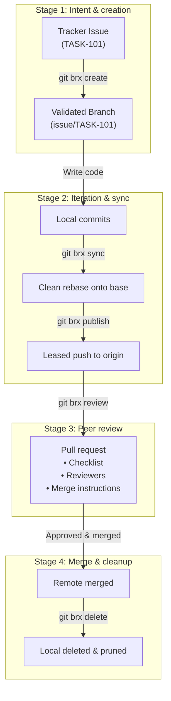

# Core philosophy & mental model

## 1. The human side of version control

Git is undeniably the industry standard for source control, but its command-line interface was designed as a plumbing toolkit rather than an ergonomic user interface. As teams grow, several systemic problems reliably emerge:

1. **Tooling intimidation & onboarding friction:** New hires, junior engineers, and specialists from non-software backgrounds (data scientists, hardware designers, technical writers) are often intimidated by Git's cryptic error messages and steep learning curve.
2. **Fear of breaking things:** Developers hesitate to rebase, synchronize, or clean up branches because one wrong command (`git push --force`, `git reset --hard`, `git checkout .`) can silently discard hours of work or overwrite a teammate's commits.
3. **Inconsistent team habits:** Without standard tooling, every developer invents their own ad-hoc aliases, naming conventions, and merge practices. Some squash locally, some create tangled merge webs, and some leave dozens of abandoned branches lingering on the remote.

### The `git-brx` solution: guardrails and brakes
`git-brx` was engineered with a clear design goal: **hide low-level Git complexities behind sensible, guardrailed automation so that developers can ship changes quickly with confidence.**

#### Why the name "brx"?
Originally a concise abbreviation for **branch**, `brx` also sounds like **brakes**—and that analogy illuminates the tool's engineering purpose:

> *"The purpose of brakes on a car isn't just to make you stop; it's to give you the confidence and control to drive fast."*

If you drive a car with spongy, unpredictable brakes, you crawl cautiously at 10 mph because every curve is terrifying. That is precisely how many developers interact with Git: paralyzed by the fear of corrupting repository history or losing their work.

`git-brx` provides the automotive brakes and stability control your team needs to move at top speed:
- **Anti-lock pushes:** Pushes always use **lease protection** (`--force-with-lease`), preventing high-speed overwrites of teammates' commits.
- **Lane keep & drift detection:** Branch switches (`git brx select`) warn if uncommitted changes would be carried across branches, preventing cross-contamination.
- **Targeted conflict management:** Conflict resolution (`git brx resolve`) isolates and stages **only** conflicted files—never blind whole-repo staging.
- **Merge-gated branch cleanup:** Branch deletion (`git brx delete`) validates that your PR was safely merged on the remote SCM before discarding local refs.
- **Emergency handbrake:** When an experiment or rebase goes awry, `git brx reset` acts as an immediate, clean stop, restoring your worktree safely from remote truth.

---

## 2. Issue-driven development: the single source of truth

At the heart of `git-brx` is a strict organizational philosophy: **every code change belongs to a tracked issue.**

```
┌────────────────────────────────────────────────────────┐
│                   THE ISSUE (Jira / GitHub)             │
│  • What is the problem?                                │
│  • Why is this change necessary?                       │
│  • What are the acceptance criteria & edge cases?      │
│  • What is the test and verification plan?             │
└───────────────────────────┬────────────────────────────┘
                            │
              1:1 Link      ▼
┌────────────────────────────────────────────────────────┐
│             THE PULL REQUEST (Code Review)             │
│  • How is the solution architected?                    │
│  • Are unit and integration tests passing?             │
│  • Is the code readable, secure, and maintainable?     │
│  • Strictly for technical peer review!                 │
└────────────────────────────────────────────────────────┘
```

### Why separate the "What" from the "How"?

In many development teams, pull requests suffer from **Scope creep during review**:
- An engineer opens a PR with minimal explanation.
- Reviewers spend days debating what the feature was actually supposed to do.
- Halfway through code review, stakeholders realize core business requirements were misunderstood.

`git-brx` enforces a clean division of responsibility:

| Artifact | Primary Audience | Core Purpose | Discussion Topics |
| :--- | :--- | :--- | :--- |
| **The issue** | Product Managers, QA, Engineers, Stakeholders | **Source of truth:** Defines *What* needs to be done and *Why*. Contains specifications, acceptance criteria, reproducible steps, and test plans. | Business requirements, edge cases, scope, user expectations. |
| **The pull request** | Engineering Peers | **Quality assurance:** Inspects *How* the code implements the issue. Verifies architecture, style, test coverage, and performance. | Implementation details, code structure, algorithm efficiency, test assertions. |

When a developer runs `git brx create issue/TASK-101`, `git-brx` reaches out to the issue tracker, verifies that `TASK-101` is a valid, assigned ticket, and sets up a local workspace directly linked to that contract.

---

## 3. The 4-Stage workflow cycle



### Stage 1: Intent & creation (`git brx create`)
You never branch from stale or arbitrary commits. `git-brx create` validates that you have an assigned task in Jira or GitHub, validates the naming convention, and branches directly off the latest base branch.

### Stage 2: Iteration & sync (`git brx sync` / `git brx publish`)
As you work, other teammates will merge changes into `master` or `main`. Instead of allowing your branch to drift into a divergence nightmare, you run `git brx sync`. For standard issue branches, `git-brx` performs a clean, linear **rebase**, replaying your commits on top of the latest trunk.

When you're ready to share your work or backup your commits, `git brx publish` pushes with `--force-with-lease` and establishes upstream tracking automatically.

### Stage 3: Peer review (`git brx review`)
When your implementation is complete and verified, running `git brx review` assembles a pull request. It automatically:
1. Links the parent Issue.
2. Injects your team's quality checklist (tests, docs, edge cases).
3. Evaluates modified components and routes the PR to the appropriate code reviewers.
4. Appends standardized, timeless merge instructions.

### Stage 4: Merge & cleanup (`git brx delete`)
Once approved and merged, local branch clutter can become overwhelming. `git brx delete` queries your SCM provider to ensure the branch was truly merged, switches your working tree safely back to `master`, deletes the local branch, and prunes stale remote references.

---

## 4. Branch taxonomy & merge discipline

`git-brx` categorizes branches into specific types, each with its own purpose, lifecycle, and merge strategy:

| Prefix | Lifespan | Typical Source | Merge Strategy | Rationale |
| :--- | :--- | :--- | :--- | :--- |
| `issue/` | Short (hours to days) | Bugs, tasks, small improvements | **Squash & merge** | Collapses experimental commits into a single clean commit on `master` with the issue title, preserving clean bisectability. |
| `feature/` | Medium (days to weeks) | Larger functional capabilities | **Merge commit (`--no-ff`)** | Preserves individual milestone commits while encapsulating the feature under a distinct merge bubble. |
| `epic/` | Long (weeks to months) | Multi-team initiatives | **Merge commit (`--no-ff`)** | Groups large architectural changes together. |
| `master` / `main` | Permanent | Trunk / single source of truth | N/A | Production-ready, always buildable and releasable. |

### The power of squash & merge for issues
Why does `git-brx` recommend **squash & merge** for standard issue branches?
- **Linear history:** The main trunk becomes an easily readable narrative: every commit represents a complete, verified unit of work linked to an issue key.
- **Flawless `git bisect`:** If a regression is introduced, `git bisect` lands directly on the single commit that introduced the issue, rather than an intermediate "WIP: fix typo" commit where the code may not even build.
- **Freedom to commit locally:** Engineers can make as many micro-commits locally as they want without worrying about polluting the shared repository history.
